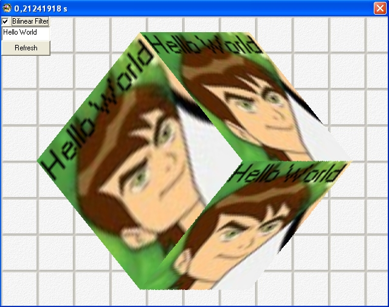



## EGL\_Bilinear Filtering

### Description

Ultra fast texture mapping with bilinear filter. Now supported text. No ASM, DX, GL.(Zip:310kb)
 
### More Info
 

             |
---                |---
**Submitted On**   |2011-04-03 11:05:12
**By**             |[Erkan Sanli](https://github.com/Planet-Source-Code/PSCIndex/blob/master/ByAuthor/erkan-sanli.md)
**Level**          |Intermediate
**User Rating**    |5.0 (10 globes from 2 users)
**Compatibility**  |VB 4\.0 \(32\-bit\), VB 5\.0, VB 6\.0
**Category**       |[Graphics](https://github.com/Planet-Source-Code/PSCIndex/blob/master/ByCategory/graphics__1-46.md)
**World**          |[Visual Basic](https://github.com/Planet-Source-Code/PSCIndex/blob/master/ByWorld/visual-basic.md)
**Archive File**   |[EGL\_Biline220119432011\.zip](https://github.com/Planet-Source-Code/erkan-sanli-egl-bilinear-filtering__1-73827/archive/master.zip)

